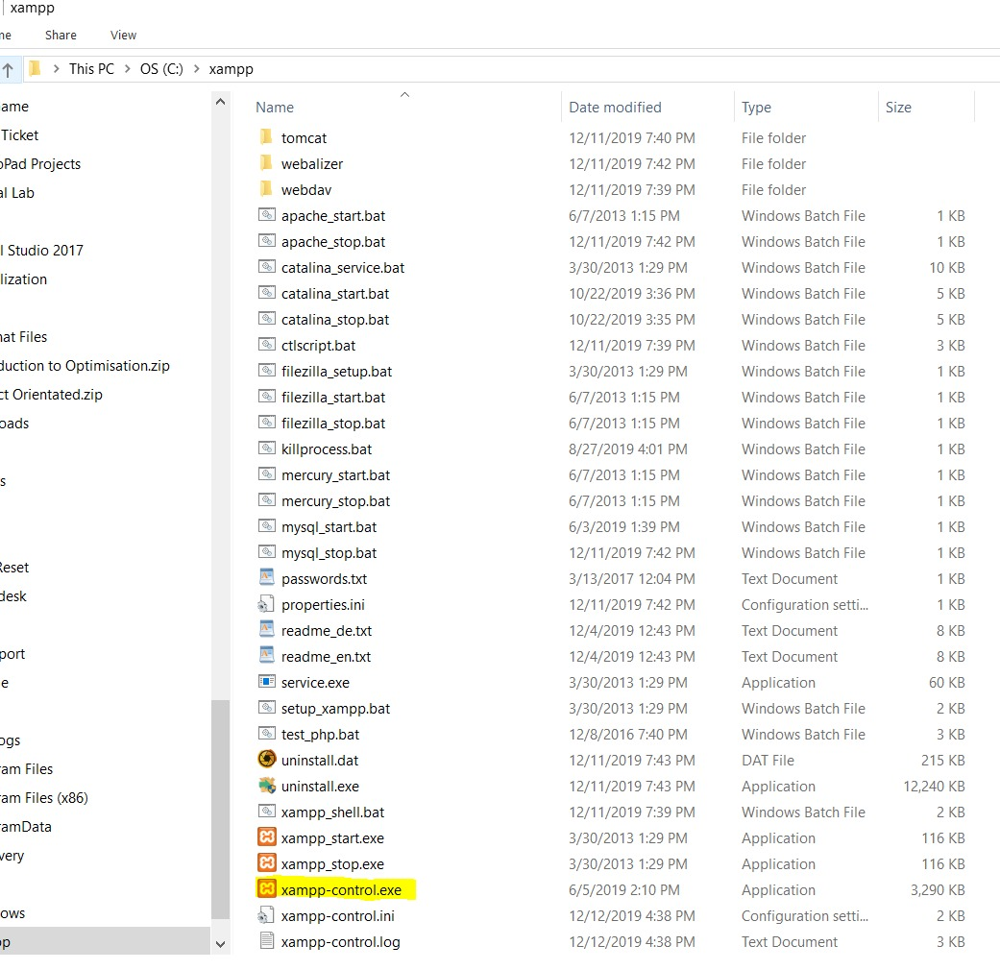
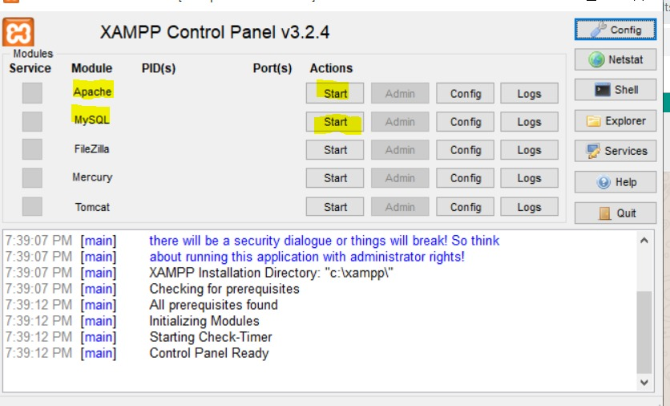

# SHM WS 2019

## Data fetching structure

```
shm-rpi
│ README.md
│
└─── nodes
│       │ SensorNodes.java
│       │ TestSuit.java   
│       └─── lib
│            └─── *.jar
│
└─── server
│       │ Server.java
│       │ TestSuit.java
│
└─── interface
        └─── rsc
        └─── src
        └─── tests
```

## Procedure (Fetching data from sensor node to server)

1. Build a hotspot, join server and sensor node (Rapberry PI) to the hotspot.
2. Check sensorNode.java file if the IP address is matching the server.
3. Launch programme in sensor node, red Led indicate programme from Thumbdrive executed.
4. Execute the Server.java programme. Hit enter in console.
5. The result should be available under Result/. folder in csv format.

**Note: In sensor node, there is a folder "Data" build in local, do not delete that folder.
folder to store local backup of data in sensor node.

## Procedure setup Database

we neeed to build a database in server to keep track of our data. SQL format is used in our project.

### Install Xampp emulator for SQL

Download Xampp programme from https://www.apachefriends.org/download.html according to your OS.

Normally the progmme folder will store under your C:\, direct to C:\xampp and launch the programme

#### Search for xampp-control.exe



#### Turn on Apache and MySQL



### Build Database

While openning xampp, go any browser(eg. Internet Explorer/ Google Chrome..) 

[xampp-remote]: http://localhost/dashboard/

You should see site as below:

#### Click at my PHP admin at top right corner

![localhost] (images/image3.jpeg)

