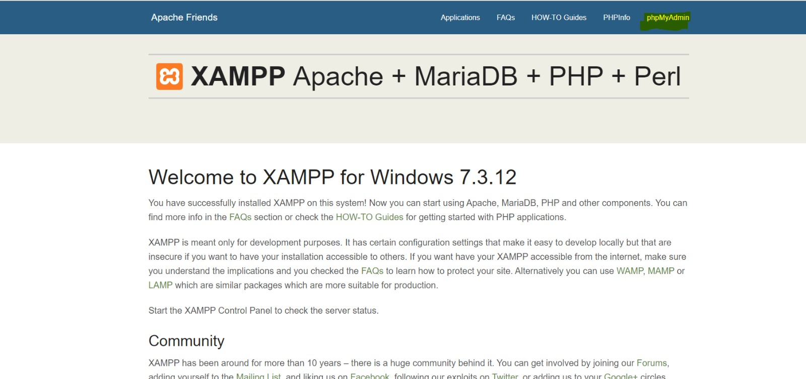
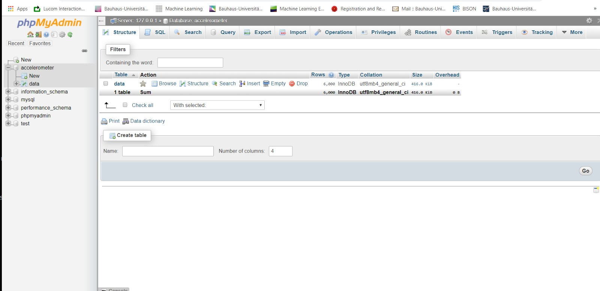
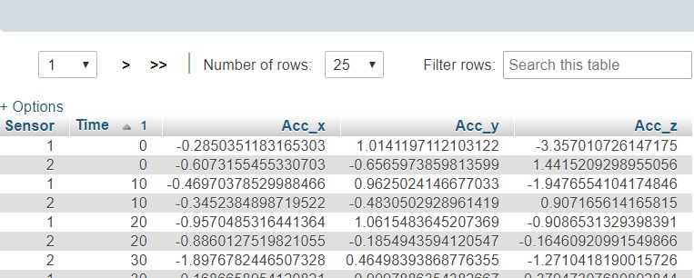
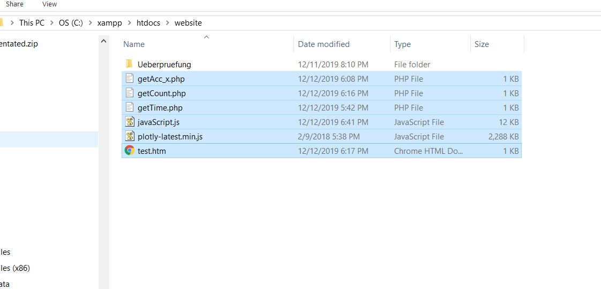

# SHM WS 2019

## Programme Sequence
### Note: Database should be built before executing Java programme.
```
1. Sensor Node send out [Acceleration x,y,z] , [Peak x,y,z]
2. Server receive [Acceleration x,y,z] , [Peak x,y,z] and store in Database
3. Database store [Acceleration x,y,z] , [Peak x,y,z]
4. Server trigger data fetch signal through Phyphox remote link
5. Phyphox send raw phone [Acceleration x,y,z]
6. Server process raw phone[Acceleration x,y,z] with baseline correction and FFT to phone[Acceleration x,y,z] , phone[Peak x,y,z]
7. Database store phone[Acceleration x,y,z] , phone[Peak x,y,z]
```
## Preset for Phone

1. Download Phyphox application from App Store
2. Refer to https://phyphox.org/remote-control/ to setup remote mode of the Phyphox Experiment
3. Use the "Time run" feature to setup the duration of the experiment
4. Note the IP address of the remote link and update the IP over Phone IP address declared in Server.java
5. The maximum number of attachable phones is 2, but with a slight modification (adding a new IP address) more phones can be attached

## Procedure (Fetching data from sensor node to server, and Phone data fetching)

1. Build a hotspot, join server and sensor node (Rapberry PI) to the hotspot.
2. Check sensorNode.java file. IP address should match the server's address.
3. Launch programme in sensor node, red Led indicates that the programme from Thumbdrive is executed.
4. Execute the Server.java programme. Hit enter in console, as requested by the Java application to start sending data form accelerometers to the sensor node, and finally forwarded to the server.
5. The result should be available under Result/. folder in csv format.
6. The programme will pause and ensure the user to save Phyphox data file
7. Copy the designated filename printed in console for the file naming of Phyphox data
8. When files are saved, Hit Enter to continue the processing of Phyphox data

**Note: In sensor node, there is a folder "Data" build in local, do not delete that folder.
folder to store local backup of data in sensor node.

## Procedure setup Database

we neeed to build a database in server to keep track of our data. SQL format is used in our project.

### Install Xampp emulator for SQL

Download Xampp programme from https://www.apachefriends.org/download.html according to your OS.

Normally, the programme folder will be stored under C:\. Go to C:\xampp and launch the programme.

#### Launch xampp-start.exe
Launch start up file for Xampp

#### Search for xampp-control.exe


#### Turn on Apache and MySQL


### View Database

While openning xampp, go to any browser(eg. Internet Explorer/ Google Chrome..) 

#### xampp-remote link: http://localhost/dashboard/

You should see the site as below:

#### Click at my PHP admin at top right corner



#### Build Database
1. A new database should be built. (By Default, the Java Database Build name is "accelerometer"
2. Under the database, different tables will be stored.
3. Java application will automatically build tables for different types of data

#####The naming convention for the different experiments is as follows:
1. For sensor node Acceleration data: "Experiment condition"+ Acc + File written Date and Time
2. For sensor node Peak data: "Experiment condition"+ Peak + File written Date and Time
3. For phone Acceleration data: "Experiment condition"+ Phyphox_Acc + File written Date and Time
4. For phone Peak data: "Experiment condition"+ Phyphox_Acc + File written Date and Time

as shown below:


Under the table, the build column style will look as below:



##------------------------------------Under development--------------------------------------------------------
## Visualize the data

Copy all files under [`Xampp/`](Xampp/) into C:\xampp\htdocs\website as shown:



#### Finally, launch test.htm
